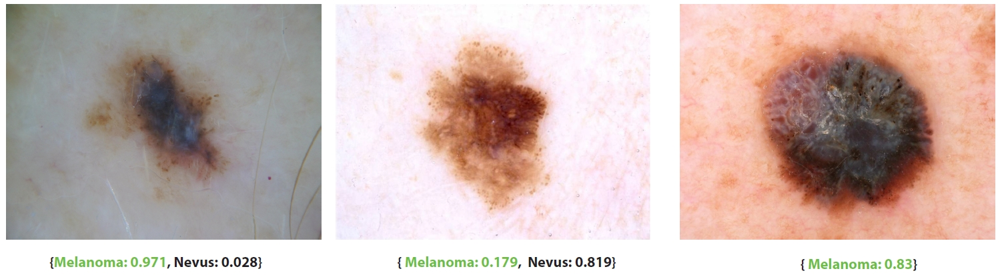

# SkinCON: Towards consensus for the uncertainty of skin cancer sub-typing through distribution regularized adaptive predictive sets (DRAPS)

### Preprint | [Project Page](https://skincon.github.io/) 

**SkinCON: Towards consensus for the uncertainty of skin cancer sub-typing through distribution regularized adaptive predictive sets (DRAPS)** 
[Zhihang Ren](https://albuspeter.github.io/), Yunqi Li*, Xinyu Li*, Xinrong Xie, Erik P. Duhaime, Kathy Fang,
[Tapabrata Chakraborty](https://profiles.ucl.ac.uk/90165-tapabrata-rohan-chakraborty),
[Yunhui Guo](https://yunhuiguo.github.io/), 
[Stella X. Yu](https://web.eecs.umich.edu/~stellayu/), 
[David Whitney](https://whitneylab.berkeley.edu/people/dave.html)
 
\* equal contribution

Deep learning has been widely utilized in medical diagnosis. Convolutional neural networks and transformers can achieve high predictive accuracy, which can be on par with or even exceed human performance. However, uncertainty quantification remains an unresolved issue, impeding the deployment of deep learning models in practical settings. Conformal analysis can, in principle, estimate the uncertainty of each diagnostic prediction, but doing so effectively requires extensive human annotations to characterize the underlying empirical distributions. This has been challenging in the past because instance-level class distribution data has been unavailable: Collecting massive ground truth labels is already challenging, and obtaining the class distribution of each instance is even more difficult. Here, we provide a large skin cancer instance-level class distribution dataset, **SkinCON**, that contains 25,331 skin cancer images from the ISIC 2019 challenge dataset. SkinCON is built upon over **937,167** diagnostic judgments from **10,509** participants. Using SkinCON, we propose the **distribution regularized adaptive predictive sets (DRAPS)** method for skin cancer diagnosis. We also provide a new evaluation metric based on SkinCON. Experiment results show the quality of our proposed DRAPS method and the uncertainty variation with respect to patient age and sex from health equity and fairness perspective.

## Setups

The code can be run under any environment with Python 3.8 and above.
(It may run with lower versions, but we have not tested it).

We recommend using [Conda](https://docs.conda.io/en/latest/) and setting up an environment:

    conda env create -f environment.yml

We experimented in an Ubuntu environment

## Accessing Dataset

* [SkinCON Dataset](https://drive.google.com/file/d/1eBdZbigqerw8lkii0Cr6monjRXCdUih8/view?usp=drive_link)

* Our original train/val dataset can be accessed [here](https://drive.google.com/file/d/1YaVQje0dnwWVaIxZEVDq5T10NMAK5ieX/view?usp=drive_link).

## Pre-Training
After downloading the dataset, you can train the model with different loss settings:

    python train.py

You can customize the training for different base models and saving directories inside the training script.

## Prediction Set Evaluation
We use the scripts from [conformal classification](https://github.com/aangelopoulos/conformal_classification.git) to evaluate the traditional methods.

After you finish pretraining different base models, you can evaluate DRAPS by running:

    python measure.py 

(Note: We found the Hit Rate is unstable regarding the testing set. Future experiments may focus on the traditional evaluation of the coverage rate and averaged set size.)

## Citation(TBD)

If you find our work inspiring or use our codebase in your research, please consider giving a star ⭐ and a citation.
